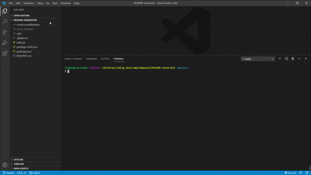

# README-Generator

A README Generator created using Node.js

## Functionality

The README-Generator uses a series of user inputs intitalized through npm-inquirer to ask the user a series of questions about their project, and runs them through a fs system to create a functional README file.  This file is placed in the folder "constructedReadme" for ease of access, and to avoid overwriting this file.



## Intitalization

After downloading the repo, the user will need to run the

```
npm i
```
command, to install inquirer and its related dependencies.  Once this is done, the user only needs to intialize  the code by running
```
node index.js
```
where they will be presented by a series of questions to help them construct their new README file.